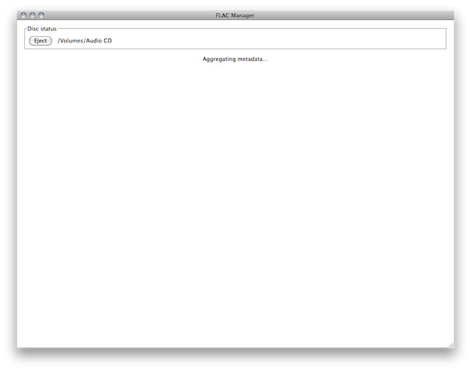
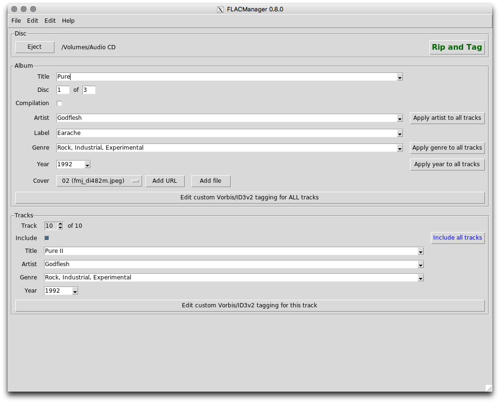
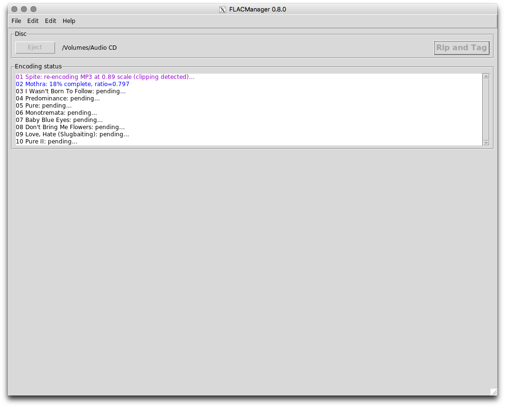

==================
Using FLAC Manager
==================

Configuring FLAC Manager
------------------------

FLAC Manager depends on a configuration file, *flacmanager.ini*, which resides
alongside the *flacmanager.py* script in the file system.

.. note::

   If *flacmanager.ini* does not exist when FLAC Manager is run (e.g. on the
   first run), it will be created with default/empty values. In this case, a
   configuration editor dialog will be opened immediately.

The default configuration looks like this::

   [Logging]
   format = %%(asctime)s %%(levelname)s %%(threadName)s %%(name)s %%(funcName)s %%(message)s
   level = WARNING
   filemode = w
   filename = flacmanager.log

   [HTTP]
   timeout = 5.0
   debuglevel = 0

   [Gracenote]
   client_id = 
   user_id = 

   [MusicBrainz]
   libdiscid_location = 
   contact_url_or_email = 

   [FLAC]
   library_root = 
   flac_encode_options = --force --keep-foreign-metadata --verify
   flac_decode_options = --force

   [MP3]
   lame_encode_options = --replaygain-accurate --clipdetect -q 2 -V2 -b 224

You **must** provide values for the Gracenote *client_id*, MusicBrainz
*libdiscid_location* and *contact_url_or_email*, and FLAC *library_root*. All
other configuration settings may be left as-is or changed to your preferences.

To obtain a Gracenote *client_id*, you must register for a
`Gracenote Developer <https://developer.gracenote.com/>`_ account and create an
application (you can call it "FLAC Manager"). Copy the Client ID for the
created application and paste it into the *flacmanager.ini* file. FLAC Manager
will take care of registering the application and persisting the *user_id* for
you.

Running FLAC Manager
--------------------

When you launch FLAC Manager (assuming you have already created/populated the
*flacmanager.ini* file with valid values), it looks for an inserted CD-DA disc:

.. image:: waiting.png

FLAC Manager is polling your optical drive in the background, and will continue
to do so until it detects that a disc has been inserted.

Once a disc has been detected, FLAC Manager begins aggregating metadata from
Gracenote and MusicBrainz:

You can abort the aggregation process by ejecting the disc. If aggregation
fails, an error message will be shown, and a button appears allowing you to
retry.

Once metadata aggregation has completed, you will be presented with the tagging
interface:

Here you can select from the aggregated metadata values or enter your own. Some
fields present the option to "Apply to all tracks," which does exactly as it
suggests - copies the current value to the corresponding field of every track.

By default, all tracks are "included," which means they will be ripped to FLAC
and MP3. To exclude a track, simply uncheck the box.

When you are satisfied with the metadata values, click the "Rip and tag" button
to begin the encoding process:

Once all included tracks have been encoded to FLAC and MP3, the "Eject" button
is enabled and you can eject the disc. FLAC Manager then waits for another
disc to be inserted.

Mapping of FLAC Manager metadata fields to iTunes metadata fields
=================================================================

================== =====================
FLAC Manager field iTunes metadata field
================== =====================
Album              Album
Disc # of #        Disc Number
Album Artist       Album Artist
Track Title        Name
Track # of #       Track Number
Track Artist       Artist
Track Genre        Genre
Track Year         Year
================== =====================

